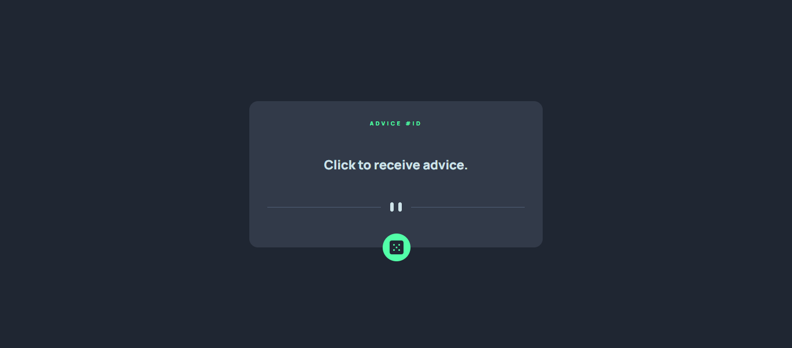
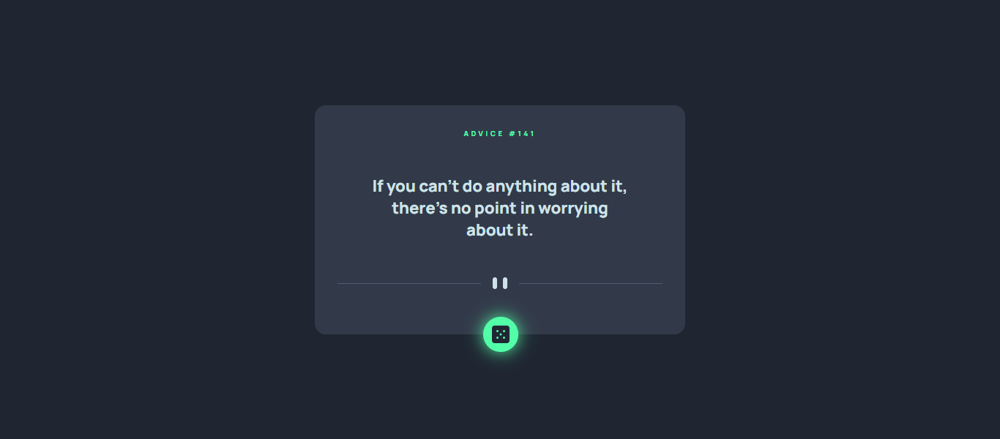

## Gerador de Conselhos 

Esse projeto de estudo foi desenvolvido a partir do desafio proposto pelo site <a href="https://www.frontendmentor.io/challenges/advice-generator-app-QdUG-13db"> Front-end Mentor</a>, onde o usuário recebe um novo conselho toda vez que clica no botão. Os conselhos são retirados da API <a href="https://api.adviceslip.com/"> Advice Slip.</a>

## Tecnologias utilizadas
> Foram utilizadas as principais linguagens do Front-end web: HTML, CSS e JavaScript puro, tendo foco no aprendizado de consumo de APIs e promises.

## Screenshots

  
  

